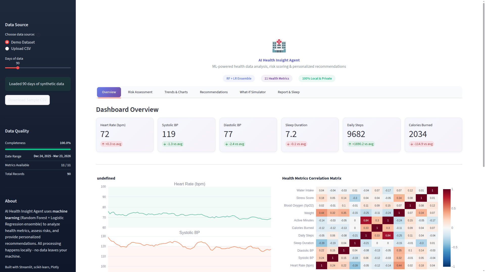
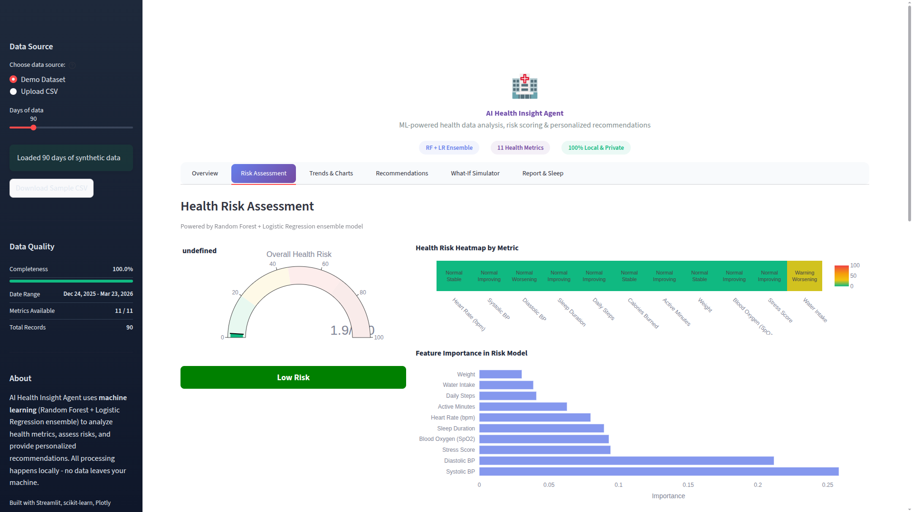
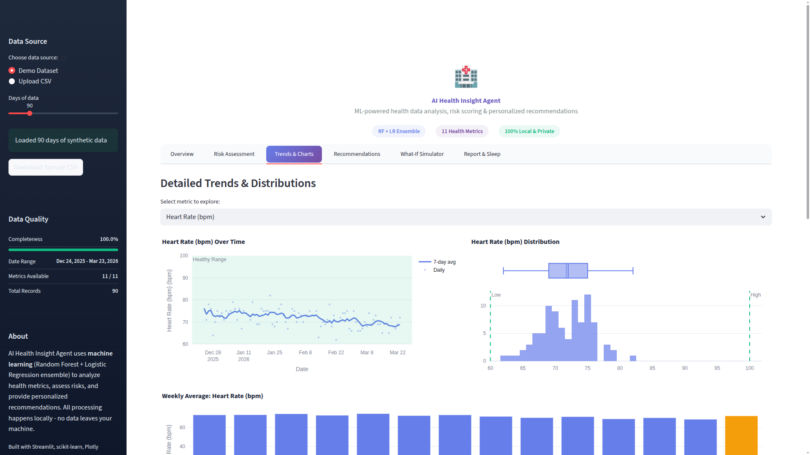
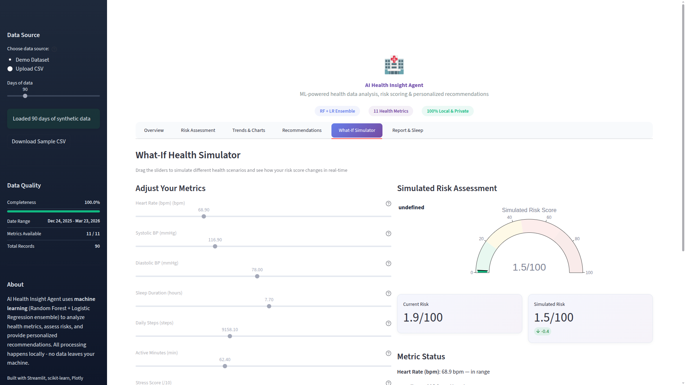
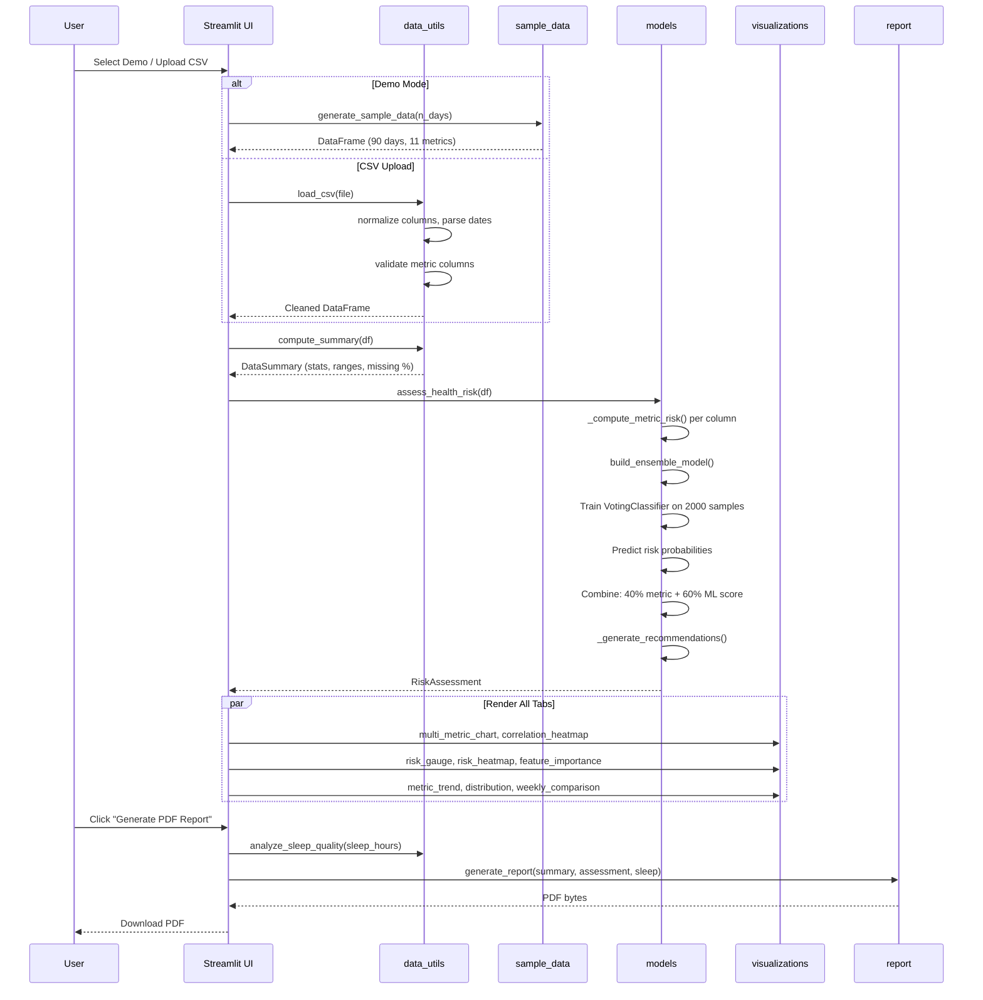
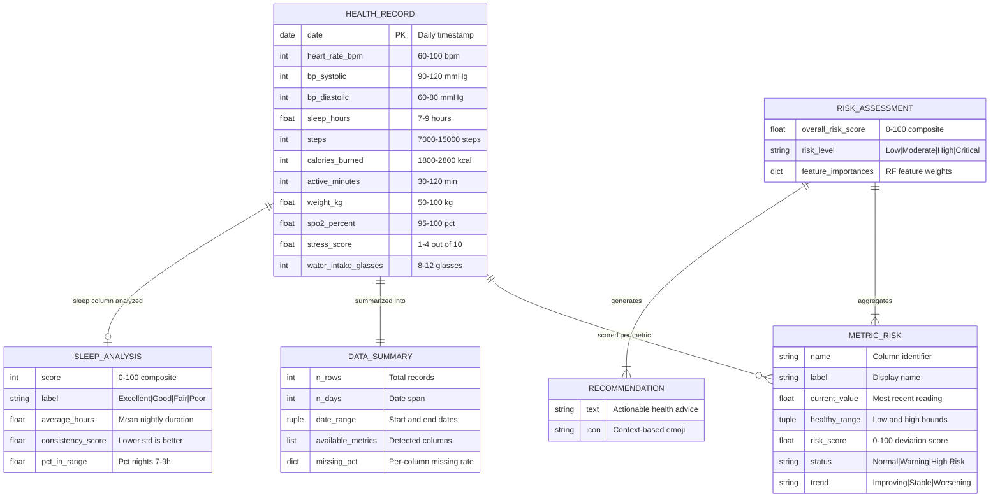

<div align="center">
  <h1>HealthPulse AI</h1>
  <p><strong>ML-powered health risk intelligence — analyze, predict, and act on 11 vital metrics, 100% offline</strong></p>

  <p>
    <a href="#quick-start">Quick Start</a> &bull;
    <a href="#features">Features</a> &bull;
    <a href="#architecture">Architecture</a> &bull;
    <a href="#tech-stack">Tech Stack</a> &bull;
    <a href="#screenshots">Screenshots</a>
  </p>

  <p>
    <a href="https://python.org"></a>
    <a href="https://streamlit.io"></a>
    <a href="https://scikit-learn.org"></a>
    <a href="https://plotly.com"></a>
    <a href="LICENSE"></a>
    
  </p>

  
</div>

---

## Features

**Ensemble ML Risk Engine** — A soft-voting `VotingClassifier` combining Random Forest (60% weight) and Logistic Regression (40% weight) trains on 2,000 synthetic population samples at runtime. It predicts three risk classes (Low / Moderate / High) from the most recent 7 days of health data, producing calibrated probability scores.

**11 Vital Health Metrics** — Tracks heart rate, systolic and diastolic blood pressure, sleep duration, daily steps, calories burned, active minutes, weight, blood oxygen (SpO2), stress score, and water intake. Each metric has clinically-informed healthy ranges and per-metric risk scoring with trend detection.

**Interactive Plotly Dashboards** — Six visualization tabs: time-series trend lines with healthy range bands, correlation heatmaps across all metrics, animated risk gauges, box+histogram distributions, weekly comparison bar charts, and multi-metric overlay plots. All charts support hover, zoom, and pan.

**Personalized Recommendations** — A rule-based engine evaluates current metric values, 7-day rolling trends, and deviation from healthy ranges to generate actionable health advice. Recommendations are context-aware: elevated blood pressure triggers dietary and exercise suggestions, low SpO2 flags urgent medical consultation.

**Sleep Quality Analyzer** — Dedicated sleep analysis module scoring duration adequacy, schedule consistency (standard deviation penalty), and percentage of nights in the 7-9 hour range. Produces a composite 0-100 sleep quality score with targeted improvement recommendations.

**Health Calculator Suite** — Built-in BMI calculator with WHO category classification (Underweight / Normal / Overweight / Obese) and a Mifflin-St Jeor calorie estimator supporting five activity levels. Outputs maintenance, weight loss (-500 kcal), and weight gain (+500 kcal) targets.

**Downloadable PDF Reports** — Professional multi-page PDF reports generated with fpdf2. Includes data overview, color-coded risk badges, per-metric analysis tables with healthy ranges, summary statistics, sleep quality breakdown, and numbered recommendations. Custom headers, footers, and page numbering.

**Privacy-First, Zero-Config** — All ML training and inference runs locally. No external APIs, no cloud uploads, no telemetry. Ships with a synthetic data generator producing realistic 90-day health datasets with weekly seasonality and gradual improvement trends, so the app works immediately without any file upload.

## Screenshots

| Dashboard Overview | Risk Assessment |
|:-:|:-:|
|  |  |
| **Trends & Distributions** | **Health Tools & Reports** |
|  |  |

## Architecture


## How It Works



## Data Model



## Quick Start

### Prerequisites

- **Python 3.12+**
- **[uv](https://docs.astral.sh/uv/)** package manager (`curl -LsSf https://astral.sh/uv/install.sh | sh`)

### Install and Run

```bash
# Clone the repository
git clone https://github.com/your-username/p1-health-agent.git
cd p1-health-agent

# Install dependencies
uv sync

# Launch the app
uv run streamlit run src/app.py
```

Opens at **http://localhost:8501**. The demo dataset loads automatically with 90 days of synthetic health data — no file upload required.

### Using Your Own Data

1. Click **Upload CSV** in the sidebar
2. Upload a CSV with a `date` column and any combination of the 11 metric columns
3. The app auto-detects columns, normalizes names, and handles missing values

### Using Make

```bash
make install    # Install dependencies
make run        # Start the app
make dev        # Start with auto-reload and debug logging
make test       # Run pytest suite
make lint       # Lint with ruff
make clean      # Remove caches and build artifacts
```

## Docker

```bash
# Build the image (multi-stage, runs as non-root)
docker build -t healthpulse-ai .

# Run the container
docker run --rm -p 8501:8501 healthpulse-ai

# Or use docker compose
docker compose up -d
```

The Dockerfile uses a multi-stage build with a non-root user and a health check endpoint at `/_stcore/health`.

## Tech Stack

| Technology | Version | Purpose |
|------------|---------|---------|
| Python | 3.12+ | Runtime |
| Streamlit | >= 1.40.0 | Web UI framework with reactive widgets and session state |
| scikit-learn | >= 1.6.0 | VotingClassifier ensemble (RandomForest + LogisticRegression) |
| Plotly | >= 5.24.0 | Interactive charts (trend, heatmap, gauge, distribution, bar) |
| pandas | >= 2.2.0 | DataFrame operations, CSV parsing, time-series resampling |
| NumPy | >= 2.0.0 | Numerical operations, synthetic data generation |
| fpdf2 | >= 2.8.0 | PDF report generation with custom layouts |
| uv | latest | Fast Python package manager and virtual environment tool |
| Docker | 20+ | Containerized deployment with multi-stage build |
| pytest | >= 9.0.2 | Test framework (dev dependency) |
| ruff | latest | Linting and formatting (dev tooling) |

## Project Structure

```
p1-health-agent/
├── src/
│   ├── __init__.py              # Package marker
│   ├── app.py                   # Streamlit UI — 6-tab layout, custom CSS, hero section (553 lines)
│   ├── models.py                # ML ensemble, per-metric risk scoring, recommendations (374 lines)
│   ├── data_utils.py            # CSV loading, validation, BMI/calorie calc, sleep analysis (244 lines)
│   ├── visualizations.py        # Plotly chart generators — 8 chart types (340 lines)
│   ├── report.py                # PDF report builder with custom HealthReport class (212 lines)
│   └── sample_data.py           # Synthetic data with weekly patterns and trends (101 lines)
├── tests/
│   ├── __init__.py
│   ├── conftest.py              # Shared pytest fixtures
│   └── test_data_utils.py       # Unit tests for data utilities
├── screenshots/
│   ├── hero.png                 # Main dashboard screenshot
│   ├── dashboard.png            # Dashboard overview
│   ├── feature1.png             # Risk assessment view
│   ├── feature2.png             # Trends and distributions
│   └── feature3.png             # Health tools and reports
├── .swarm/                      # Agent coordination files
├── Dockerfile                   # Multi-stage build, non-root user
├── docker-compose.yml           # Single-service compose config
├── pyproject.toml               # Project metadata and dependencies
├── Makefile                     # install, run, dev, test, lint, docker targets
├── .env.example                 # Environment variable template
├── .gitignore                   # Python, venv, IDE, OS ignores
├── LICENSE                      # MIT License
└── README.md                    # This file
```

## Supported Health Metrics

| Metric | Column Name | Unit | Healthy Range | Risk Direction |
|--------|------------|------|:-------------:|----------------|
| Heart Rate | `heart_rate_bpm` | bpm | 60 – 100 | Lower is better within range |
| Systolic BP | `bp_systolic` | mmHg | 90 – 120 | Lower is better within range |
| Diastolic BP | `bp_diastolic` | mmHg | 60 – 80 | Lower is better within range |
| Sleep Duration | `sleep_hours` | hours | 7 – 9 | Within range is optimal |
| Daily Steps | `steps` | steps | 7,000 – 15,000 | Higher is better |
| Calories Burned | `calories_burned` | kcal | 1,800 – 2,800 | Within range is optimal |
| Active Minutes | `active_minutes` | min | 30 – 120 | Higher is better |
| Weight | `weight_kg` | kg | 50 – 100 | Within range is optimal |
| Blood Oxygen | `spo2_percent` | % | 95 – 100 | Higher is better |
| Stress Score | `stress_score` | /10 | 1 – 4 | Lower is better |
| Water Intake | `water_intake_glasses` | glasses | 8 – 12 | Higher is better |

## ML Model Details

### Ensemble Architecture

The risk engine uses a **soft-voting `VotingClassifier`** combining two classifiers:

- **RandomForestClassifier** — 100 trees, max depth 8, weight 0.6. Captures non-linear interactions between metrics. Provides feature importance rankings.
- **LogisticRegression** — max 1000 iterations, weight 0.4. Adds a linear decision boundary as a regularizing counterpart to the forest.

### Training Data

The model trains on **2,000 synthetic population samples** generated at runtime with `np.random.default_rng(seed=123)`. Each sample contains 10 features (all metrics except `calories_burned` which is derived). Labels are assigned by a rule-based system with noise injection:

- **High Risk (2):** risk count >= 3 (elevated HR, high BP, low sleep, low SpO2, high stress)
- **Moderate (1):** risk count >= 1.5
- **Low (0):** risk count < 1.5

### Risk Score Computation

```
overall_risk = 0.4 * avg_metric_deviation + 0.6 * ml_probability_score
```

Where `ml_probability_score = P(moderate) * 40 + P(high) * 100`. The metric deviation score is computed per-column as percentage deviation from the healthy range, capped at 100.

### Risk Classification

| Score Range | Level | Color |
|:-----------:|:-----:|:-----:|
| 0 – 19 | Low | Green |
| 20 – 44 | Moderate | Orange |
| 45 – 69 | High | Red |
| 70 – 100 | Critical | Dark Red |

## Testing

```bash
# Run the full test suite
make test

# Or directly with pytest
uv run pytest tests/ -v

# Quick import validation
uv run python -c "from src.sample_data import *; print('Imports OK')"
```

## Environment Variables

All variables are optional. The app runs with zero configuration.

| Variable | Default | Description |
|----------|---------|-------------|
| `STREAMLIT_SERVER_PORT` | `8501` | Port for the Streamlit server |
| `STREAMLIT_SERVER_HEADLESS` | `true` | Run without opening a browser tab |
| `STREAMLIT_BROWSER_GATHER_USAGE_STATS` | `false` | Disable Streamlit telemetry |
| `STREAMLIT_LOGGER_LEVEL` | `info` | Log level (debug, info, warning, error) |

Copy `.env.example` to `.env` to customize:

```bash
cp .env.example .env
```

## Contributing

1. Fork the repository
2. Create a feature branch: `git checkout -b feature/your-feature`
3. Make changes with type hints and docstrings
4. Run `make lint` and `make test`
5. Commit with conventional commits: `feat(scope): description`
6. Open a pull request against `main`

Code standards: strict type hints, docstrings on all public functions, files under 300 lines, functions under 50 lines. Linting via ruff.

## License

[MIT](LICENSE) — use it freely for personal, educational, or commercial projects.

## Acknowledgments

- **scikit-learn** for the VotingClassifier ensemble framework
- **Streamlit** for the reactive web UI with zero frontend code
- **Plotly** for publication-quality interactive visualizations
- **fpdf2** for server-side PDF generation without external dependencies
- Health metric ranges informed by AHA, WHO, and NIH published guidelines
