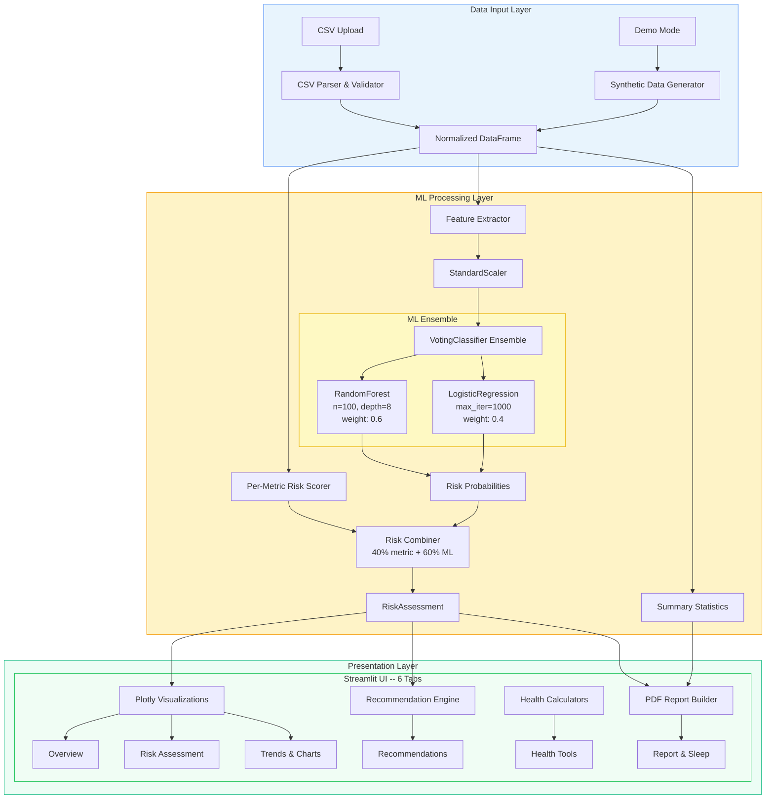
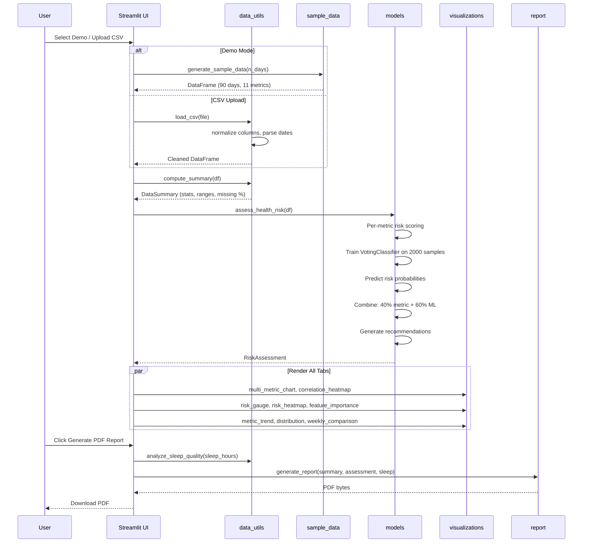

<div align="center">
  <h1>HealthPulse AI</h1>
  <p><strong>ML-powered health risk intelligence -- analyze, predict, and act on 11 vital metrics, 100% offline.</strong></p>

  <p>
    <a href="#quick-start">Quick Start</a> &bull;
    <a href="#features">Features</a> &bull;
    <a href="#architecture">Architecture</a> &bull;
    <a href="#tech-stack">Tech Stack</a> &bull;
    <a href="#screenshots">Screenshots</a>
  </p>

  <p>
    
    
    
    
    
    
  </p>

  
</div>

---

## Features

**Ensemble ML Risk Engine** -- A soft-voting `VotingClassifier` combining Random Forest (60% weight) and Logistic Regression (40% weight) trains on 2,000 synthetic population samples at runtime. Predicts three risk classes (Low / Moderate / High) from the most recent 7 days of health data with calibrated probability scores.

**11 Vital Health Metrics** -- Tracks heart rate, systolic and diastolic blood pressure, sleep duration, daily steps, calories burned, active minutes, weight, blood oxygen (SpO2), stress score, and water intake. Each metric has clinically-informed healthy ranges and per-metric risk scoring with trend detection.

**Interactive Plotly Dashboards** -- Six visualization tabs: time-series trend lines with healthy range bands, correlation heatmaps, animated risk gauges, box+histogram distributions, weekly comparison bar charts, and multi-metric overlay plots.

**Personalized Recommendations** -- Rule-based engine evaluating current metric values, 7-day rolling trends, and deviation from healthy ranges. Context-aware: elevated blood pressure triggers dietary and exercise suggestions, low SpO2 flags urgent medical consultation.

**Sleep Quality Analyzer** -- Dedicated sleep analysis scoring duration adequacy, schedule consistency (standard deviation penalty), and percentage of nights in the 7-9 hour range. Composite 0-100 sleep quality score with improvement recommendations.

**Health Calculator Suite** -- BMI calculator with WHO classification (Underweight / Normal / Overweight / Obese) and Mifflin-St Jeor calorie estimator supporting five activity levels.

**Downloadable PDF Reports** -- Multi-page PDF reports with fpdf2. Includes risk badges, per-metric analysis tables with healthy ranges, summary statistics, sleep quality breakdown, and numbered recommendations.

**Privacy-First, Zero-Config** -- All ML training and inference runs locally. No external APIs, no cloud uploads. Ships with a synthetic data generator producing realistic 90-day health datasets.

## Screenshots

| Dashboard Overview | Risk Assessment |
|:-:|:-:|
|  |  |
| **Trends & Distributions** | **Health Tools & Reports** |
|  |  |

## Architecture



### Data Flow



## Quick Start

### Prerequisites

- **Python 3.12+**
- **[uv](https://docs.astral.sh/uv/)**

### Install and Run

```bash
git clone https://github.com/Akasxh/healthpulse-ai.git
cd healthpulse-ai

uv sync
uv run streamlit run src/app.py
```

Opens at **http://localhost:8501**. Demo dataset (90 days of synthetic health data) loads automatically.

### Using Your Own Data

1. Click **Upload CSV** in the sidebar
2. Upload a CSV with a `date` column and any combination of the 11 metric columns
3. The app auto-detects columns, normalizes names, and handles missing values

### Using Make

```bash
make install    # Install dependencies
make run        # Start the app
make dev        # Start with auto-reload and debug logging
make test       # Run pytest suite
make lint       # Lint with ruff
```

## Docker

```bash
docker build -t healthpulse-ai .
docker run --rm -p 8501:8501 healthpulse-ai

# Or with docker compose
docker compose up -d
```

---

## Supported Health Metrics

| Metric | Column Name | Unit | Healthy Range |
|--------|------------|------|:-------------:|
| Heart Rate | `heart_rate_bpm` | bpm | 60 -- 100 |
| Systolic BP | `bp_systolic` | mmHg | 90 -- 120 |
| Diastolic BP | `bp_diastolic` | mmHg | 60 -- 80 |
| Sleep Duration | `sleep_hours` | hours | 7 -- 9 |
| Daily Steps | `steps` | steps | 7,000 -- 15,000 |
| Calories Burned | `calories_burned` | kcal | 1,800 -- 2,800 |
| Active Minutes | `active_minutes` | min | 30 -- 120 |
| Weight | `weight_kg` | kg | 50 -- 100 |
| Blood Oxygen | `spo2_percent` | % | 95 -- 100 |
| Stress Score | `stress_score` | /10 | 1 -- 4 |
| Water Intake | `water_intake_glasses` | glasses | 8 -- 12 |

---

## ML Model Details

### Ensemble Architecture

The risk engine uses a **soft-voting `VotingClassifier`** combining:

- **RandomForestClassifier** -- 100 trees, max depth 8, weight 0.6. Captures non-linear interactions. Provides feature importance rankings.
- **LogisticRegression** -- max 1000 iterations, weight 0.4. Adds a linear decision boundary as a regularizing counterpart.

### Risk Score Computation

```
overall_risk = 0.4 * avg_metric_deviation + 0.6 * ml_probability_score
```

Where `ml_probability_score = P(moderate) * 40 + P(high) * 100`. Metric deviation is per-column percentage deviation from healthy range, capped at 100.

### Risk Classification

| Score Range | Level | Color |
|:-----------:|:-----:|:-----:|
| 0 -- 19 | Low | Green |
| 20 -- 44 | Moderate | Orange |
| 45 -- 69 | High | Red |
| 70 -- 100 | Critical | Dark Red |

---

## Tech Stack

| Technology | Version | Purpose |
|------------|---------|---------|
| Python | 3.12+ | Runtime |
| Streamlit | >= 1.40.0 | Web UI with reactive widgets and session state |
| scikit-learn | >= 1.6.0 | VotingClassifier ensemble (RF + LR) |
| Plotly | >= 5.24.0 | Interactive charts (trend, heatmap, gauge, distribution) |
| pandas | >= 2.2.0 | DataFrame operations, CSV parsing |
| NumPy | >= 2.0.0 | Numerical operations, synthetic data generation |
| fpdf2 | >= 2.8.0 | PDF report generation |
| uv | latest | Package manager |
| Docker | 20+ | Containerized deployment |
| pytest | >= 9.0.2 | Test framework |

---

## Project Structure

```
healthpulse-ai/
├── src/
│   ├── __init__.py
│   ├── app.py                   # Streamlit UI -- 6-tab layout, custom CSS (553 lines)
│   ├── models.py                # ML ensemble, per-metric risk scoring, recommendations (374 lines)
│   ├── data_utils.py            # CSV loading, validation, BMI/calorie calc, sleep analysis (244 lines)
│   ├── visualizations.py        # 8 Plotly chart types (340 lines)
│   ├── report.py                # PDF report builder with custom HealthReport class (212 lines)
│   └── sample_data.py           # Synthetic data with weekly patterns and trends (101 lines)
├── tests/
│   ├── conftest.py
│   ├── test_data_utils.py
│   ├── test_models.py
│   ├── test_sample_data.py
│   ├── test_visualizations.py
│   └── test_report.py
├── screenshots/
├── Dockerfile                   # Multi-stage build, non-root user
├── docker-compose.yml
├── pyproject.toml
├── Makefile                     # install, run, dev, test, lint, docker targets
├── requirements.txt
├── .env.example
├── .gitignore
└── LICENSE                      # MIT
```

---

## Testing

```bash
make test
# or
uv run pytest tests/ -v

# Quick import validation
uv run python -c "from src.sample_data import *; print('Imports OK')"
```

---

## Contributing

1. Fork the repository
2. Create a feature branch: `git checkout -b feature/your-feature`
3. Add type hints and docstrings
4. Run `make lint` and `make test`
5. Commit with conventional commits: `feat(scope): description`
6. Open a pull request

---

## License

[MIT](LICENSE)
